# ImgUpscaler AI - Architecture & Flow Diagrams

## System Architecture Overview

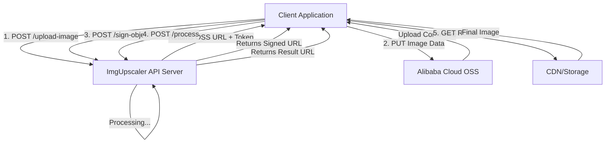

---

## Complete Upload & Processing Flow

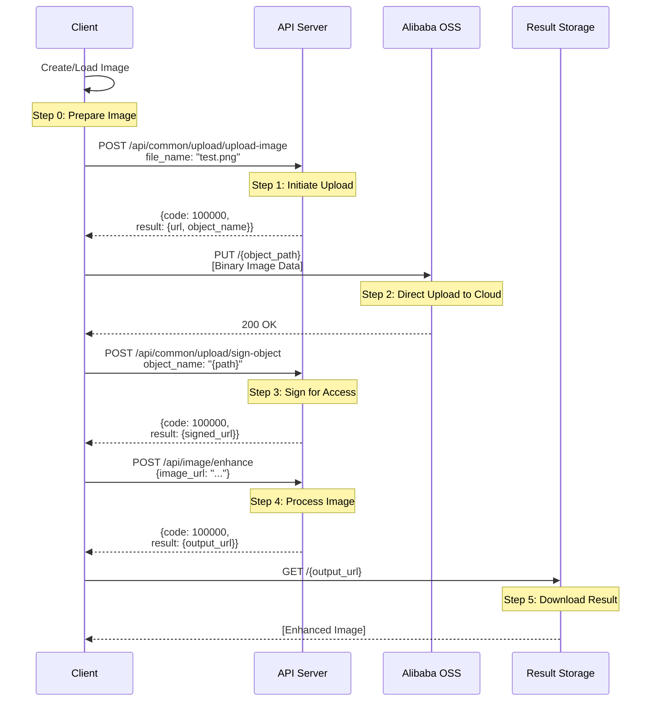

---

## API Endpoint Hierarchy

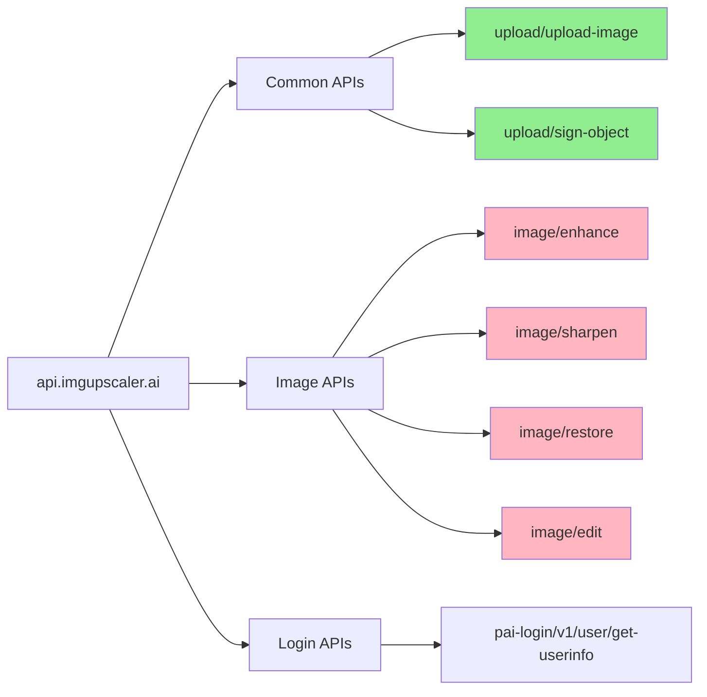

**Legend:**
- 🟢 Green = Confirmed Working
- 🔴 Pink = Discovered, Needs Testing

---

## Data Flow Architecture

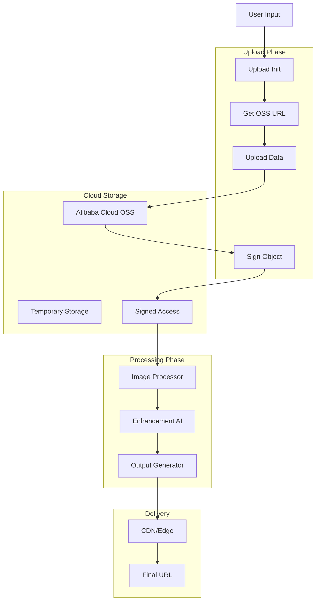

---

## Component Interaction Map

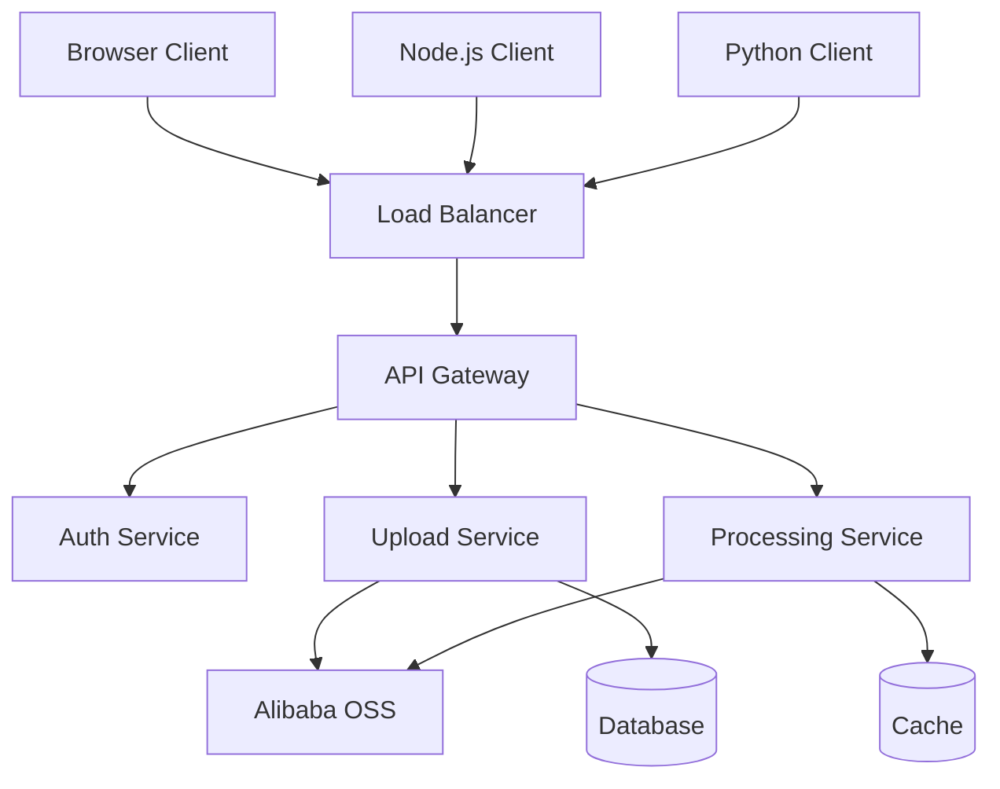

---

## State Machine for Image Processing

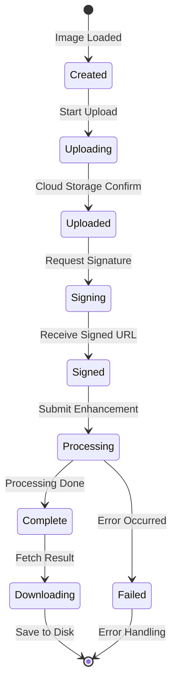

---

## Network Request Timeline

```mermaid
gantt
    title Image Upscale Operation Timeline
    dateFormat X
    axisFormat %L ms
    
    section Client
    Prepare Image     :a1, 0, 100
    Init Upload       :a2, after a1, 50
    Upload to OSS     :a3, after a2, 2000
    Sign Object       :a4, after a3, 50
    Process Image     :a5, after a4, 5000
    Download Result   :a6, after a5, 1000
    
    section Server
    Upload Init       :b1, 50, 50
    Sign Generation   :b2, 2100, 50
    AI Processing     :b3, 2200, 5000
    
    section Storage
    OSS Upload        :c1, 150, 2000
    Result Storage    :c2, 7200, 500
```

---

## Error Handling Flow

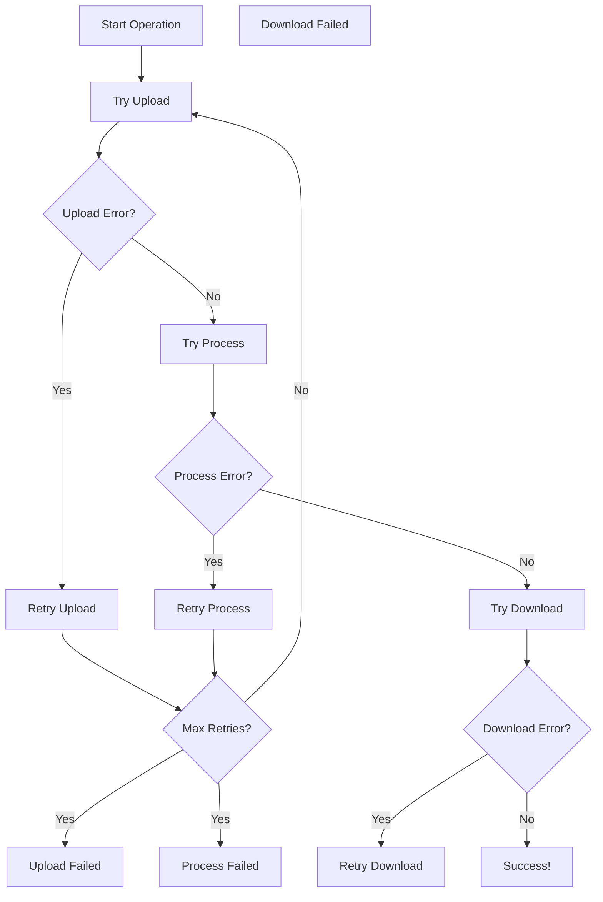

---

## Service Dependencies

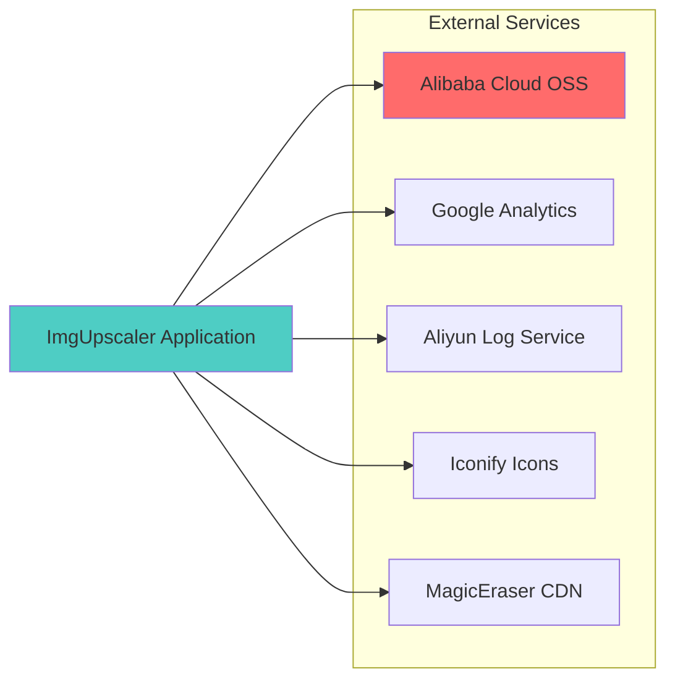

**Red** = Critical Dependency (Alibaba OSS for storage)  
**Teal** = Main Application

---

## File Structure Generated by Analysis

```
imgupscaler_project/
│
├── imgupscaler_complete.js          # Main implementation
├── test_imgupscaler_all_endpoints.js # Endpoint tester
├── reverse_imgupscaler.js           # Browser automation
├── test_imgupscaler_upload.js       # Upload capture
│
├── IMGUPSCALER_COMPLETE_API_DOCS.md # Full documentation
├── IMGUPSCALER_QUICK_START.md       # Quick guide
├── IMGUPSCALER_PROJECT_SUMMARY.md   # This summary
├── ARCHITECTURE_DIAGRAMS.md         # This file
│
├── imgupscaler_analysis/
│   ├── complete_data.json          # Initial analysis
│   └── endpoints.txt               # Endpoint list
│
├── imgupscaler_upload_analysis/
│   ├── upload_analysis.json        # Upload flow data
│   └── endpoints.txt               # Upload endpoints
│
├── imgupscaler_endpoint_tests/      # Test results (generated)
│   └── test_results_*.json
│
└── imgupscaler_output/              # Processed images (generated)
    └── *_upscaled.*
```

---

## Authentication & Headers Flow

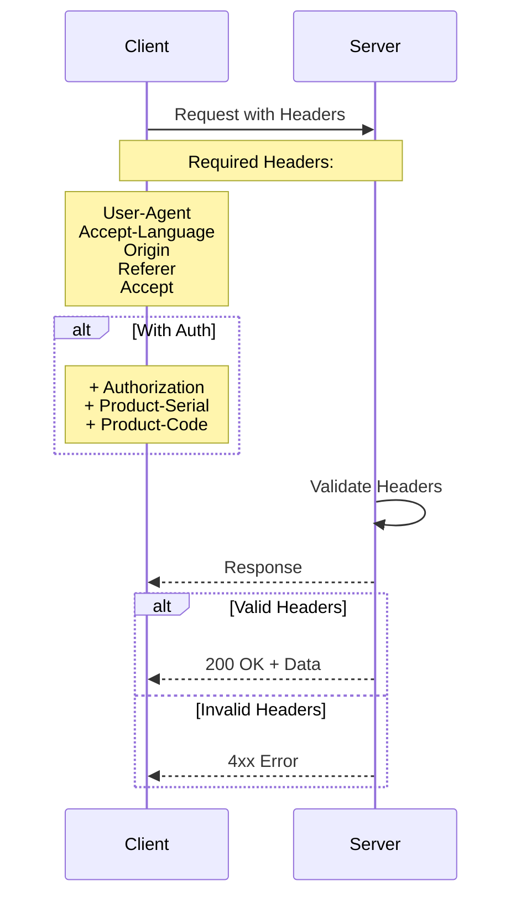

---

## Rate Limiting Strategy (Inferred)

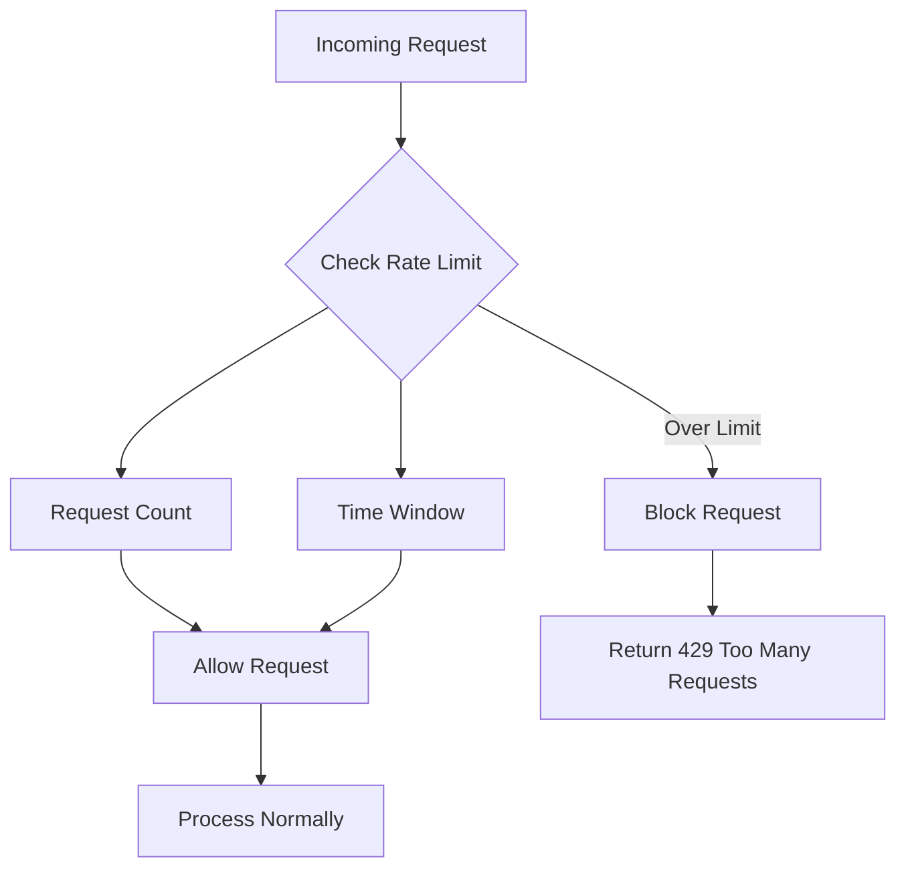

*Note: Actual rate limits unknown - requires testing*

---

## Scalability Considerations

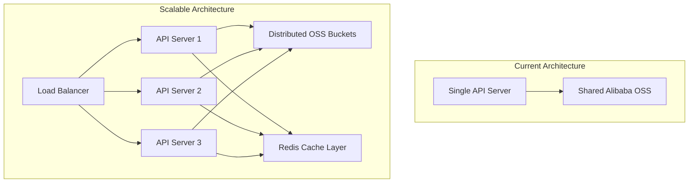

---

## Security Model

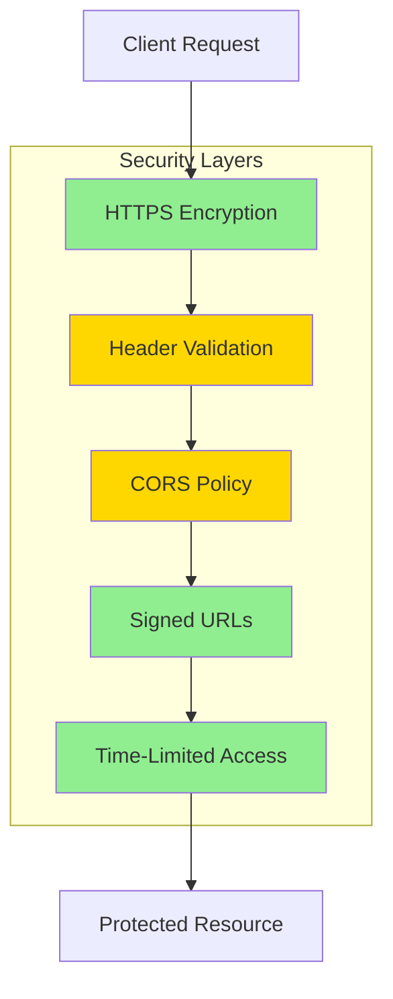

**Green** = Strong Security Measure  
**Yellow** = Moderate/Unknown Security

---

## Monitoring Points (Discovered)

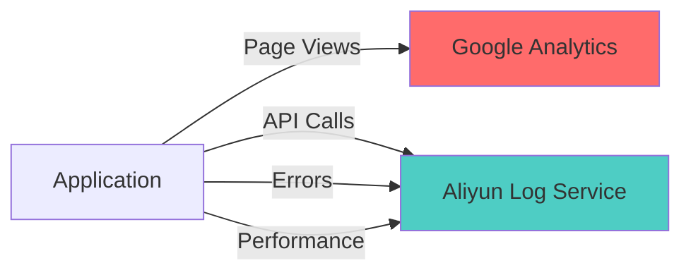

**Detected Tracking:**
- Google Analytics (G-KFJ6N97K1V)
- Aliyun Log Store (web-imgupsclaer)

---

These diagrams provide a complete visual understanding of the ImgUpscaler system architecture, flows, and components.
