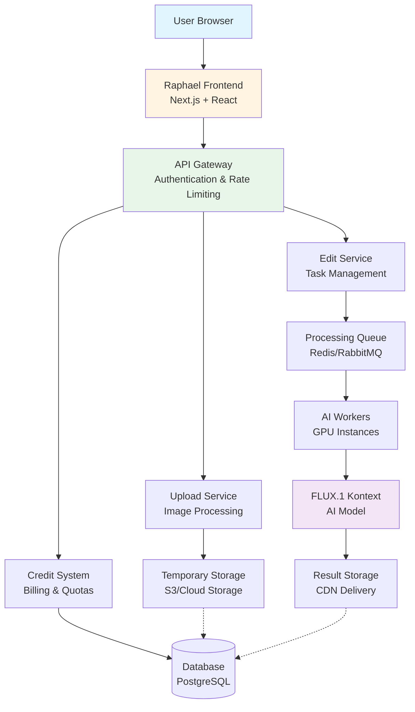
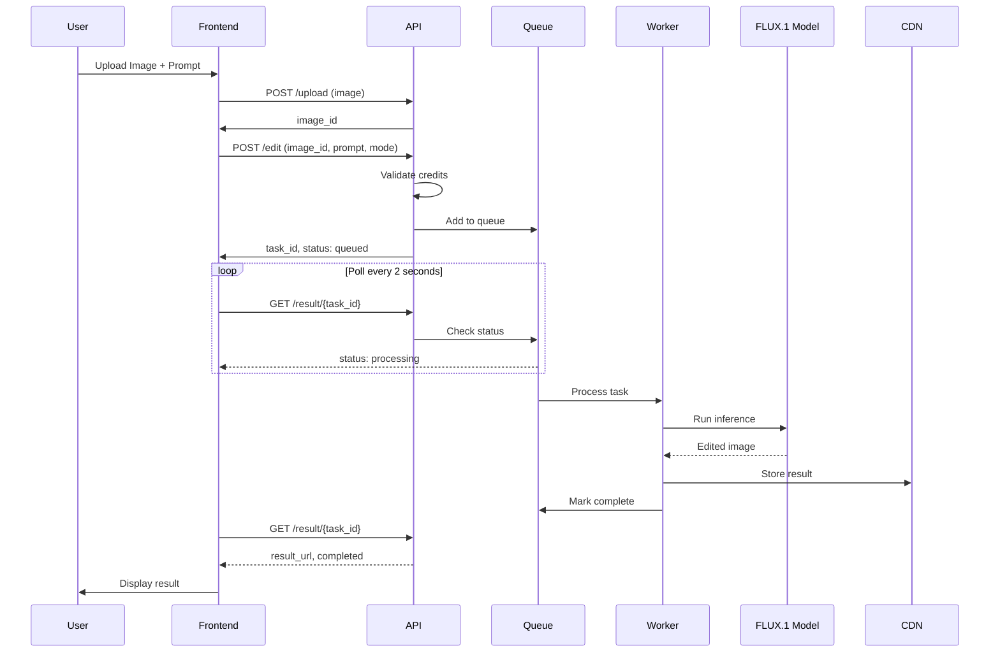
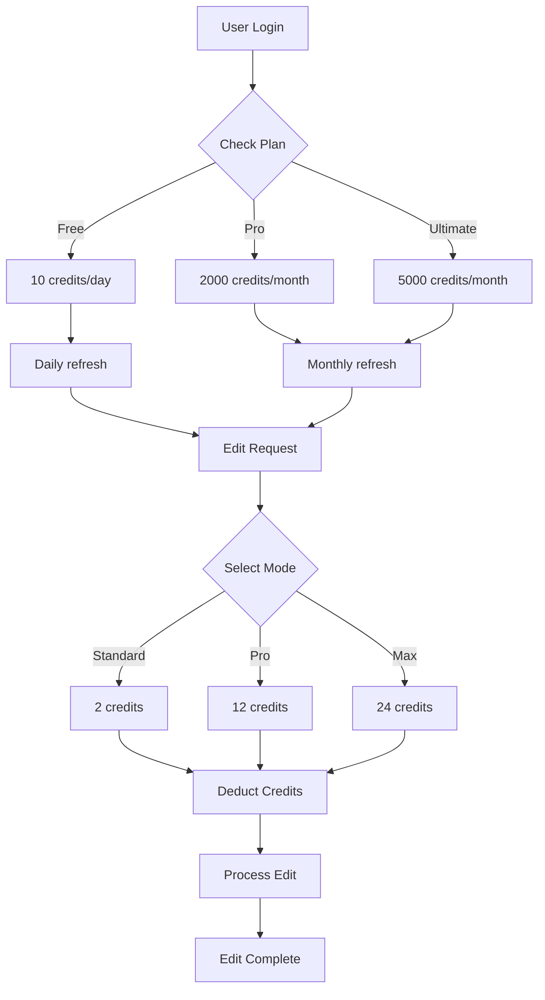
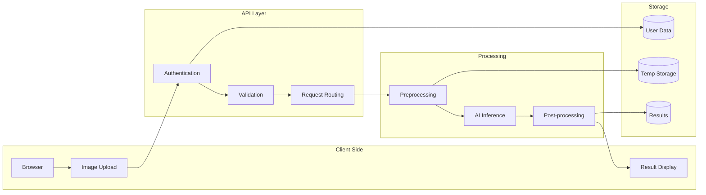
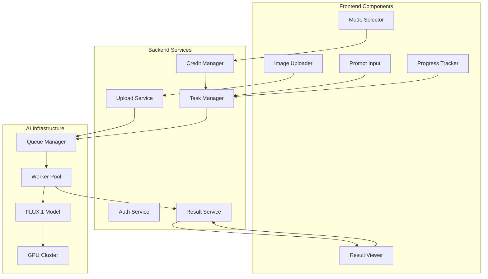
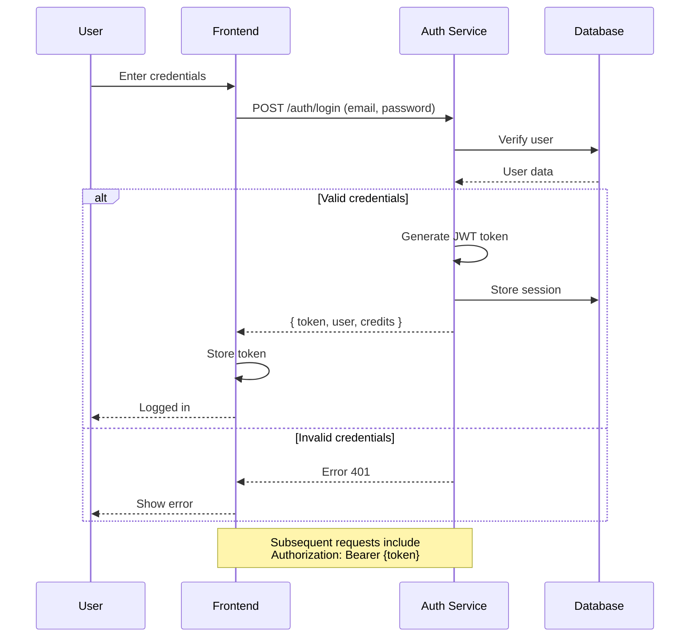
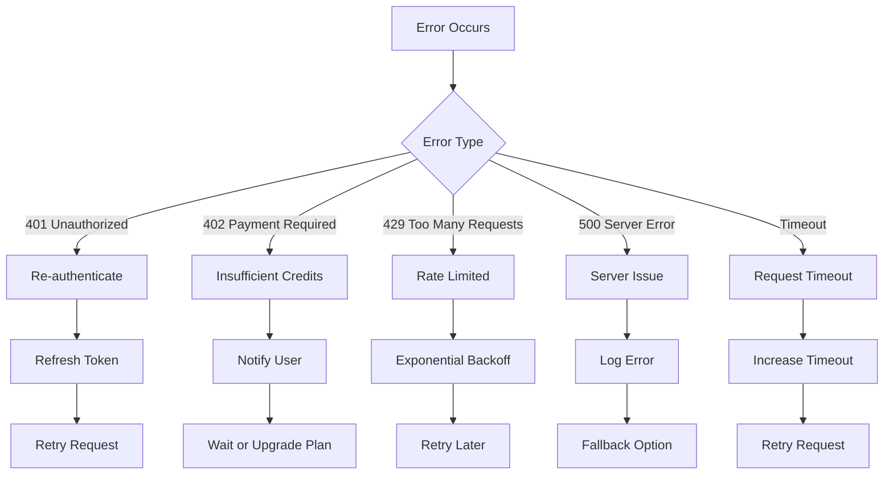
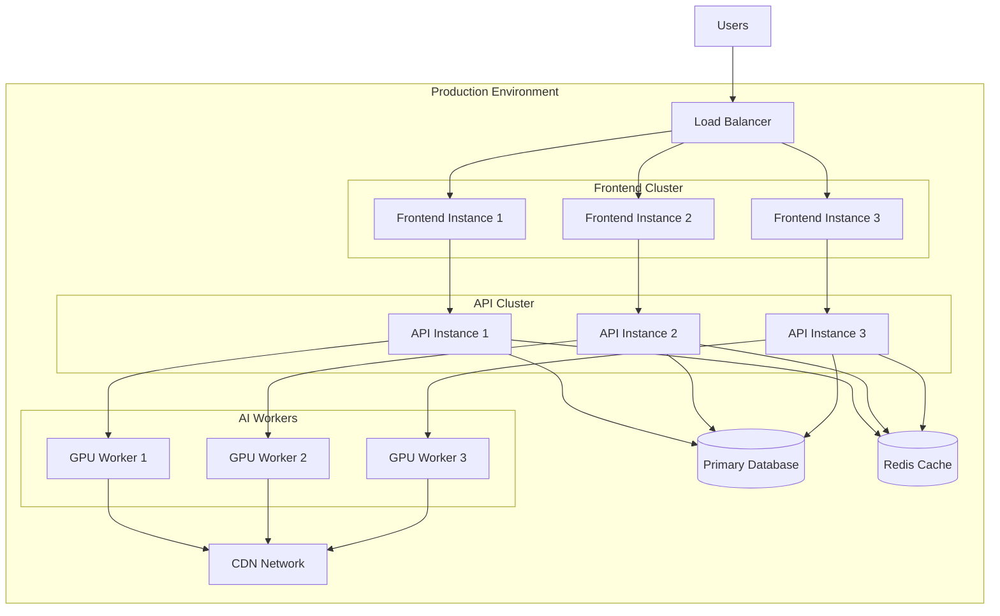
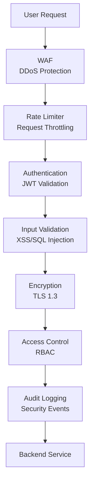

# Raphael AI Architecture - Visual Diagrams

## System Overview



## Request Flow



## Credit System Flow



## Data Flow Architecture



## Component Interaction



## Authentication Flow



## Error Handling Flow



## Deployment Architecture



## Technology Stack

```
┌─────────────────────────────────────────────┐
│              Frontend Layer                 │
│  Next.js, React, TypeScript, TailwindCSS   │
└─────────────────────────────────────────────┘
                    ↓
┌─────────────────────────────────────────────┐
│              API Layer                      │
│  Node.js, Express/Fastify, JWT Auth        │
└─────────────────────────────────────────────┘
                    ↓
┌─────────────────────────────────────────────┐
│           Processing Layer                  │
│  Python, PyTorch, Diffusers, CUDA          │
└─────────────────────────────────────────────┘
                    ↓
┌─────────────────────────────────────────────┐
│           Storage Layer                     │
│  PostgreSQL, Redis, S3, CloudFlare CDN     │
└─────────────────────────────────────────────┘
```

## API Endpoint Map

```
/api/v1
├── /auth
│   ├── /login          POST   - User authentication
│   ├── /register       POST   - User registration
│   ├── /refresh        POST   - Token refresh
│   └── /me             GET    - Current user info
│
├── /images
│   ├── /upload         POST   - Image upload
│   ├── /{id}           GET    - Get image info
│   └── /{id}           DELETE - Delete image
│
├── /edit
│   ├── /               POST   - Create edit task
│   ├── /{task_id}      GET    - Get task status
│   └── /{task_id}      DELETE - Cancel task
│
├── /results
│   ├── /{task_id}      GET    - Download result
│   └── /{task_id}/url  GET    - Get result URL
│
├── /credits
│   ├── /               GET    - Get credit balance
│   ├── /history        GET    - Credit usage history
│   └── /plans          GET    - Available plans
│
└── /user
    ├── /profile        GET    - User profile
    ├── /history        GET    - Edit history
    └── /preferences    PUT    - Update preferences
```

## Performance Metrics

```
Typical Request Timeline:
├── Upload (0-2s)
│   └── Image compression & validation
│
├── Queue Wait (0-15s)
│   └── Depends on plan & load
│
├── Processing (5-20s)
│   ├── Preprocessing (1-2s)
│   ├── AI Inference (3-15s)
│   └── Post-processing (1-3s)
│
└── Download (0-3s)
    └── CDN delivery

Total: 6-40 seconds
Average: ~20 seconds
```

## Security Layers



---

These diagrams provide a complete visual understanding of how Raphael AI and similar systems work internally. Use them as reference for building your own implementation!
