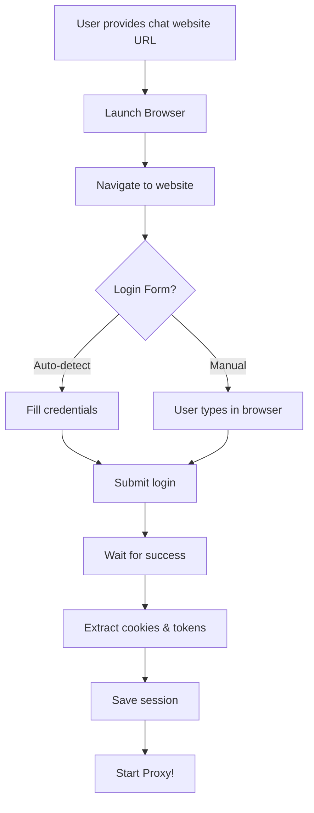

# 🌐 Universal Chat Website Proxy

**Login to ANY chat website and proxy it!** 🚀

## ✨ Features

- 🌐 **Works with chat WEBSITES** (not just APIs)
- 🔐 **Automated browser login** - Username/password authentication
- 🍪 **Auto-extracts cookies & tokens** from your session
- 🤖 **Supports any chat site** - ChatGPT, Claude, Poe, DeepSeek, etc.
- ⚡ **Instant proxy** - OpenAI-compatible endpoints
- 💾 **Saves sessions** - Login once, reuse forever
- 🔄 **AUTO-REFRESH** - Re-login when session expires (LIKE QWEN!)
- 🔍 **Smart monitoring** - Checks session every 5 minutes

---

## 🚀 Quick Start

### 1. Install Dependencies
```bash
npm install
```

### 2. Launch Your Proxy
```bash
node src/index.js https://chat.openai.com
```

### 3. Login Flow
The system will:
1. 🌐 **Launch a real browser** (visible to you)
2. 🔐 **Ask for username/password** in terminal
3. ⌨️  **Auto-fill login form** (or let you type manually)
4. 🍪 **Extract all cookies & tokens** after login
5. 💾 **Save session** for next time
6. 🚀 **Start proxy server**!

---

## 💡 Examples

### ChatGPT (OpenAI)
```bash
node src/index.js https://chat.openai.com
```
Enter your OpenAI email/password → Proxy running!

### Claude (Anthropic)
```bash
node src/index.js https://claude.ai
```
Login with Google/Email → Extract session → Ready!

### Poe (Quora)
```bash
node src/index.js https://poe.com
```
Login → Get bot access → Proxy enabled!

### DeepSeek Chat
```bash
node src/index.js https://chat.deepseek.com
```
Username/password → Session saved!

### Any Other Chat Website
```bash
node src/index.js https://any-chat-site.com
```
Auto-detects login form → Works!

---

## 📡 Using Your Proxy

Once running, your proxy is available at:
```
http://localhost:8787
```

### Endpoints:

#### Health Check
```bash
curl http://localhost:8787/health
```

#### Chat (OpenAI Compatible)
```bash
curl http://localhost:8787/v1/chat/completions \
  -H "Content-Type: application/json" \
  -d '{
    "model": "default-model",
    "messages": [{"role": "user", "content": "Hello!"}]
  }'
```

#### Session Info
```bash
curl http://localhost:8787/session
```

#### Refresh Session (Re-login)
```bash
curl -X POST http://localhost:8787/refresh
```

---

## 🎯 How It Works



### What Gets Extracted:

1. **Cookies** - All session cookies
2. **localStorage** - Stored data from browser
3. **sessionStorage** - Temporary session data
4. **Auth Tokens** - JWT, bearer tokens, etc.

All of these are used to authenticate your API requests!

---

## 🛠️ Commands

### Start New Proxy
```bash
node src/index.js <API_URL>
```

### Use Saved Config
```bash
node src/index.js
```

### Reset Configuration
```bash
node src/index.js --reset
```

### Show Help
```bash
node src/index.js --help
```

### Development Mode (Auto-reload)
```bash
npm run dev
```

---

## 📁 Project Structure

```
universal-ai-proxy/
├── src/
│   ├── index.js              # Main entry point
│   ├── auth-detector.js      # Auto-detect auth type
│   ├── setup-wizard.js       # Interactive setup
│   └── proxy-server.js       # Express proxy server
├── config.json               # Saved configuration
├── package.json
└── README.md
```

---

## 🔐 Authentication Types Supported

### 1. No Authentication
Some APIs are public - just works!

### 2. API Key (Bearer Token)
Most common - header like `Authorization: Bearer sk-xxx`

### 3. Custom API Key
Header like `X-API-Key: your-key` or `api-key: your-key`

### 4. OAuth 2.0
Token-based - requires login flow

### 5. Manual/Custom
Configure any custom headers manually

---

## 💻 Use Cases

### 1. Use Multiple AIs
Switch between different AI providers easily:
```bash
# Terminal 1: DeepSeek
node src/index.js https://api.deepseek.com/v1/chat/completions

# Terminal 2: Another AI
node src/index.js https://other-ai.com/api/chat
```

### 2. Frontend Integration
Your React/Vue app can talk to any AI:
```javascript
fetch('http://localhost:8787/v1/chat/completions', {
  method: 'POST',
  headers: { 'Content-Type': 'application/json' },
  body: JSON.stringify({
    model: 'default-model',
    messages: [{ role: 'user', content: 'Hello!' }]
  })
});
```

### 3. Testing Different AIs
Quickly test new AI APIs without rewriting code!

### 4. Local Development
Develop against any AI API with consistent interface!

---

## 🎨 Why This Is Amazing

✅ **Universal** - Works with ANY AI URL  
✅ **Smart** - Auto-detects what you need  
✅ **Easy** - One command setup  
✅ **Fast** - Instant proxy, no delays  
✅ **Flexible** - Supports all auth types  
✅ **Persistent** - Saves your config  
✅ **Standard** - OpenAI compatible  

---

## 🚧 Advanced Features (Coming Soon)

- [ ] Multi-account load balancing (like Qwen worker)
- [ ] Automatic token refresh (for OAuth)
- [ ] Rate limiting per user
- [ ] Request/response logging
- [ ] Custom transformations
- [ ] WebSocket support
- [ ] Streaming responses

---

## 📝 Configuration File

After first setup, `config.json` is created:

```json
{
  "apiUrl": "https://api.deepseek.com/v1/chat/completions",
  "authType": "api_key",
  "config": {
    "headerName": "Authorization",
    "headerPrefix": "Bearer ",
    "instructions": "..."
  },
  "credentials": {
    "apiKey": "sk-your-key-here"
  },
  "createdAt": "2026-03-07T..."
}
```

Next time just run: `node src/index.js` (no arguments needed!)

---

## 🆘 Troubleshooting

### "No API URL provided"
You need to provide a URL on first run:
```bash
node src/index.js https://api.example.com/v1/chat/completions
```

### "Invalid API key"
Double-check your key, make sure there are no spaces.

### "Insufficient balance"
Add credits to your AI service account.

### "Connection timeout"
Check if the API URL is correct and accessible.

### Clear and restart
```bash
node src/index.js --reset
node src/index.js <NEW_URL>
```

---

## 🎯 What Makes This Special

Traditional approach:
```
Need DeepSeek proxy → Build DeepSeek-specific code
Need Qwen proxy → Build Qwen-specific code  
Need OpenAI proxy → Build OpenAI-specific code
= Hours of work for each! 😫
```

**Universal Proxy approach:**
```
Any AI URL → node src/index.js <URL> → DONE! ✅
= 10 seconds! 🚀
```

---

## 🌟 Real Example

```bash
$ node src/index.js https://api.deepseek.com/v1/chat/completions

🌍 Universal AI Proxy System v1.0
==================================================

🔍 Analyzing API endpoint...

Test 1: Checking if public (no auth)...
❌ Requires authentication (401)

Test 2: Checking for API Key auth...
✅ Detected: Authorization Bearer token required

📝 API Key Authentication Detected

ℹ️  This API requires Authorization Bearer authentication

🔑 Get your FREE API key at:
   https://platform.deepseek.com/api_keys

Paste your API key: ***********

🧪 Testing your API key...
✅ API key is valid and working!

💾 Configuration saved to: ./config.json

🚀 Universal AI Proxy is running!
📡 Listening on: http://localhost:8787
🎯 Target API: https://api.deepseek.com/v1/chat/completions
🔐 Auth Type: api_key

💡 Test it with:
   curl http://localhost:8787/health
```

**DONE!** Your proxy is live and ready! 🎉

---

## 🎊 You Just Built The Future!

One universal system for ALL AI APIs! 🔥

No more custom integrations for every new AI service!

Just: **URL → Proxy → Done!** ⚡

---

Made with ❤️ for the AI community!
